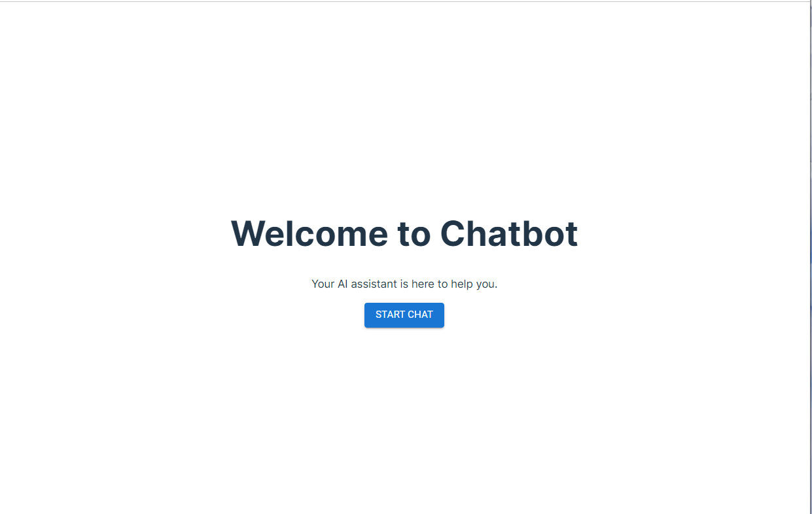
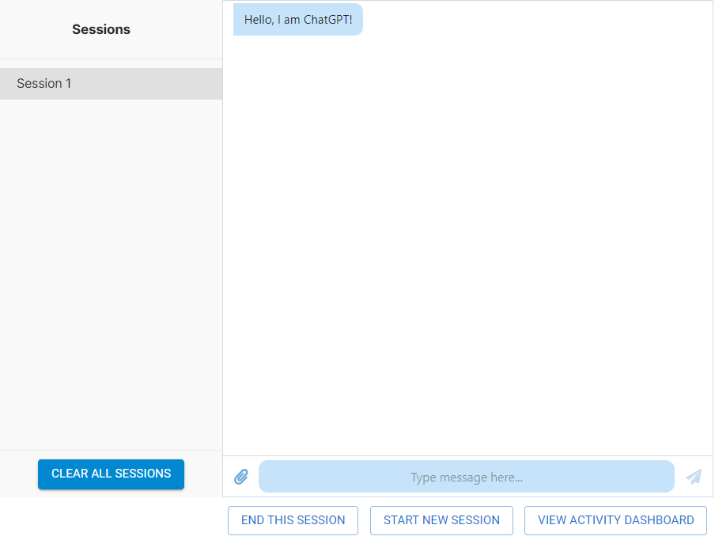
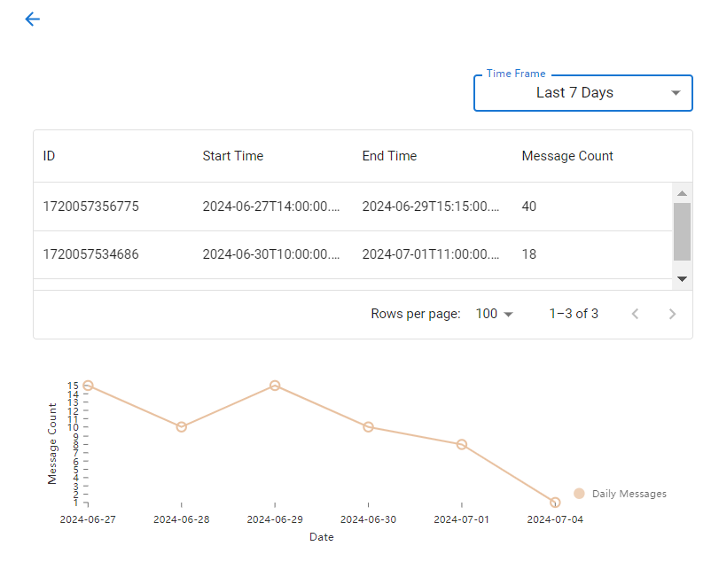

# QuantumBot React Application

## Description

The QuantumBot React Application is a chat interface built using React and various other modern web development tools. It features a welcome page, a chat interface, session management, and an activity dashboard that provides real-time user activity metrics.

## Tools Used

- **React**: A JavaScript library for building user interfaces.
- **MUI (Material-UI)**: React components for faster and easier web development.
- **Firebase**: Backend-as-a-Service (BaaS) that provides various tools including Cloud Messaging.
- **Nivo**: A React library for data visualization.
- **Chatscope Chat UI Kit**: A set of React components for building chat UI.

## Acknowledgements

We would like to acknowledge the open-source community and the developers of the libraries and tools used in this project.

## Screen Shots

### Welcome Page



### Chat Page



### Activity Dashboard



## Set Up Instructions

Follow these steps to set up the project locally:

1. **Clone the repository:**

   ```bash
   git clone https://github.com/YanbingChen/cosmochat_onboarding.git
   cd cosmochat_onboarding
   git checkout new_branch
   cd app
   ```

2. **Install dependencies:**

   ```bash
   npm install
   ```

3. **Set up Firebase:**

   - Ensure you have Firebase SDK installed:
     ```bash
     npm install firebase
     ```
   - Create a Firebase project in the Firebase console with cloud messaging enabled.

   - Config a firebase-messaging-sw.js file in the public directory(refer to the [Firebase documentation](https://firebase.google.com/docs/web/setup#add-sdks-initialize) for more details).
   - Follow the prompts to set up Firebase in your project directory.

4. **Set up environment variables:**
   Create a `.env` file in the root of your project and add the following environment variables:

   ```bash
   VITE_OPENAI_API_KEY=your_openai_api_key
   VITE_VAPID_PUBLIC_KEY=your_vapid_public_key
   VITE_FIREBASE_API_KEY=your_firebase_api_key
   VITE_FIREBASE_AUTH_DOMAIN=your_firebase_auth_domain
   VITE_FIREBASE_PROJECT_ID=your_firebase_project_id
   VITE_FIREBASE_STORAGE_BUCKET=your_firebase_storage_bucket
   VITE_FIREBASE_MESSAGING_SENDER_ID=your_firebase_messaging_sender_id
   VITE_FIREBASE_APP_ID=your_firebase_app_id
   VITE_FIREBASE_DATABASE_URL=your_firebase_database_url
   ```

5. **Run the application:**
   ```bash
   npm run dev
   ```

## Usage Guidelines

- **Starting a new chat session:**
  - On the welcome page, click "Start Chat" to enter the chat interface.
  - If no session exists, a new session will be created automatically.
- **Managing chat sessions:**
  - Use the buttons at the bottom of the chat window to start a new session or end the current session.
  - The session sidebar allows you to switch between existing sessions or clear all sessions.
- **Viewing activity dashboard:**
  - Click on the "Activity" button in the session management section to view user activity metrics.

## Code structure and organization

The project is organized as follows:

```
cosmochat_onboarding/app
│
├── public/ # Public assets
│ ├── index.html # firebase service worker registration
│ ├── firebase-messaging-sw.js # firebase service worker (should be created manually)
├── src/
│ ├── assets/
│ ├── components/
│ │ ├── ActivityDashboard.jsx
│ │ ├── ChatContainer.jsx
│ │ ├── DataGridTable.jsx
│ │ ├── LandingPage.jsx
│ │ ├── LineChart.jsx
│ │ ├── SessionManagement.jsx
│ │ ├── SessionSidebar.jsx
│ │ ├── customSidebar.css
│ ├── data/
│ │ ├── previous_info_session.js # mock data for previous sessions
│ ├── hooks/
│ │ ├── useChat.js
│ │ ├── useSessions.js
│ │ ├── useFirebaseMessaging.js
│ ├── utils/
│ │ └── api.js
│ ├── App.jsx
│ ├── main.jsx
│ ├── index.css
│ ├── firebase.js # Firebase initialization
│ └── App.css
├── .env # Environment variables (needs to be created manually)
├── .eslintrc.cjs # ESLint configuration
├── .gitignore # Git ignore file
├── index.html # HTML template
├── package-lock.json # NPM package lock file
├── package.json # NPM package file
├── README.md # default README file
└── vite.config.js # Vite configuration
```

## Additional Information

- **Firebase Setup:** Ensure that you have set up your Firebase project and have the necessary configurations in the `.env` file.
- **OpenAI API:** Obtain an API key from OpenAI and set it in the `.env` file.

For any questions or support, please refer to the project's GitHub repository or contact the project maintainers.
